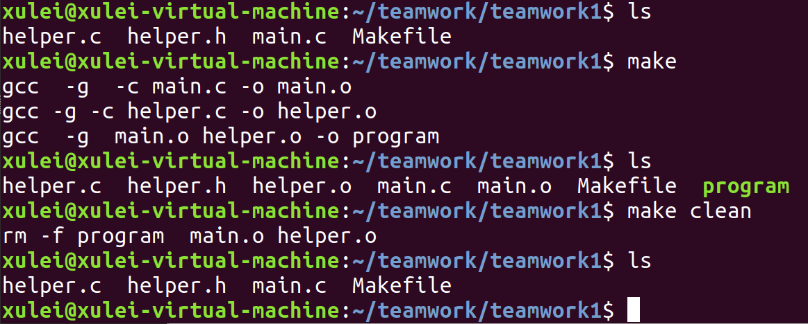

# Teamwork1

**uPuZu 丁帅 李亚男 徐磊(按姓氏首字母排序)**

[TOC]

## 实验目的

配置Linux环境，安装相应工具并掌握使用方法

## 实验内容

1. [安装Linux环境](#安装Linux环境)
2. [编写C文件](#编写C文件)
3. [编写Makefile](#编写Makefile)
4. [通过autotools生成Makefile](#通过autotools生成Makefile)
5. [使用git提交作业](#使用git提交作业)

## 实验内容与结果

- ### <a name="安装Linux环境" >安装Linux环境</a>

  - 没写

- ### <a name="编写C源文件" >编写C源文件</a>

  - main.c

    ```c
    #include "helper.h"
    #include <stdlib.h>
    
    int main(int argc,char* argv[]){
    	if(argc != 3){
    		printf("参数数量有误\n");
    		return 1;
    	}
    	
    	int x = atoi(argv[1]);
    	int y = atoi(argv[2]);
    	printf("%d+%d=%d,%d-%d=%d\n",x,y,add(x,y),x,y,sub(x,y));
    	return 0;
    }
    ```

  - helper.c

    ```c
    #include "helper.h"
    
    int add(int x,int y){
        return x+y;
    }
    
    int sub(int x,int y){
        return x-y;
    }	
    ```

  - helper.h

    ```c
    #ifndef _HELPER_H
    #define _HELPER_H
    #include <stdio.h>
    
    int add(int x,int y);
    int sub(int x,int y);
    
    #endif
    ```

  - 操作截图

    

    

- ### <a name="编写Makefile" >编写Makefile</a>

  - Makefile

    ```makefile
    #My makefile
    TARGETS = program 
    OBJS = main.o helper.o
    HDRS = helper.h 
    CFLAGS = -g 
    CC = gcc 
    
    #-c表示只编译不链接
    program: $(OBJS)
    	$(CC) $(CFLAGS) $(OBJS) -o program
    main.o: main.c helper.h
    	$(CC) $(CFLAGS) -c $< -o $@
    helper.o: helper.c helper.h
    	gcc -g -c helper.c -o helper.o
    	
    .PHONY: clean 
    clean:  
    	rm -f $(TARGETS) $(OBJS) 
    ```

  - 操作流程

    

    

  - 运行结果

    > 

    

- ### <a name="通过autotools生成Makefile" >通过autotools生成Makefile</a>

  - autoscan及configure.ac重命名

    > 

  - configure.ac

    ```
    #                                               -*- Autoconf -*-
    # Process this file with autoconf to produce a configure script.
    
    AC_PREREQ([2.69])
    AC_INIT(program,1.0)
    AM_INIT_AUTOMAKE(program,1.0)
    AC_CONFIG_SRCDIR([main.c])
    AC_CONFIG_HEADERS([config.h])
    
    # Checks for programs.
    AC_PROG_CC
    
    # Checks for libraries.
    
    # Checks for header files.
    AC_CHECK_HEADERS([stdlib.h])
    
    # Checks for typedefs, structures, and compiler characteristics.
    
    # Checks for library functions.
    AC_CONFIG_FILES([Makefile]) 
    AC_OUTPUT
    ```

  - aclocal, autoconf, autoheader

    > 

  - 创建Makefile.am

    ```
    AUTOMAKE_OPTIONS = foreign 
     
    bin_PROGRAMS = program 
    program_SOURCES = main.c helper.c
    ```

    > 

  - automake --add-missing以及创建相应的error文件

    > 
    >
    > 

  - ./configure

    > 

  - make指令测试

    > 

    > 
    >
    > 
    >
    > 

- ### <a name="使用git提交作业" >使用git提交作业</a>

  - 没写

## 实验总结

没写

## 实验源代码

code文件夹下存放