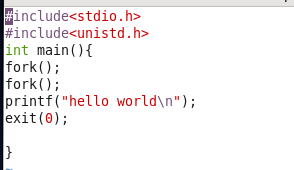
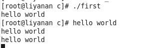
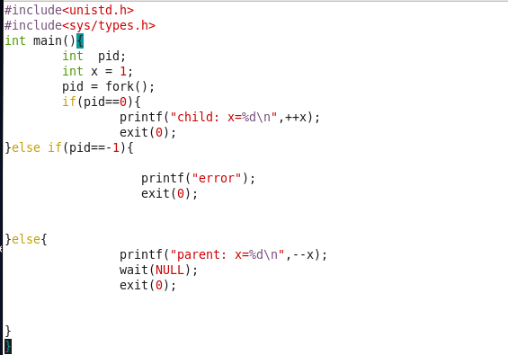
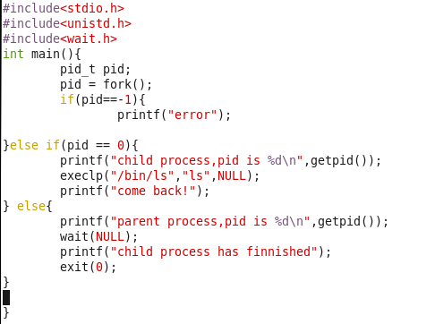
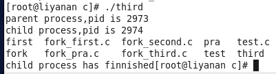
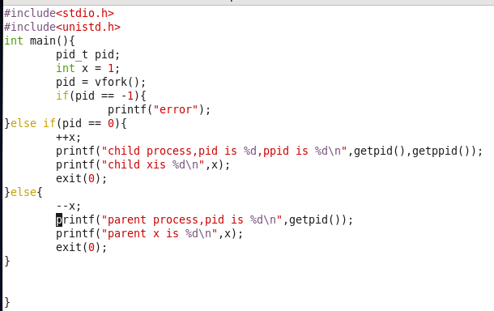
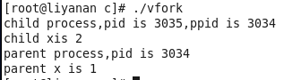

# Teamwork2

**uPuZu 丁帅 李亚男 徐磊(按姓氏首字母排序)**

## 1、fork()与vfork()

### fork函数代码

* （1）fork函数能够创建子进程

***代码***：




***结果***:



***分析***：

​        代码中的第一个fork函数是父进程创建了一个子进程，父子进程打印输出，第二个fork函数使父进程和子进程都创建了一个子进程并打印；并且***子进程继承了父进程的stdout文件，可以输出指向屏幕，父子进程***。

​		因此使用fork函数创建进程有***共享文件***的特点。

* （2）wait+fork函数

***代码***



***结果***


***分析***

① 使用wait函数可以使父进程阻塞到子进程执行结束后退出。

② fork函数创建进程的***”相同的但是独立的地址空间“***特点。可见父进程和子进程都是独立的进程，具有自己的私有地址空间，父进程对变量x的修改不会反映在子进程中。

* （3）fork+wait+execve函数

***代码***



***结果***



***分析***

在父进程执行打印后，wait函数会阻塞父进程直到子进程执行完代码。

在子进程中会执行execlp函数，并且看到执行完execlp函数后没有再返回，***说明exec不返回到调用进程***。

### vfork函数

### 代码



### 结果




### 分析

​		使用vfork函数创建进程，***子进程先于父进程运行***，不需要在父进程中使用wait阻塞。

​		vfork***使用复制指针的方法使父子进程内存共享***，因此看到子进程中对x的操作会影响父进程对x的操作，因为x仅此一份。

### 比较

​		经过上述实验，可以看到fork与vfork都是创建进程，但有以下不同：

​	1、***父子进程执行顺序***。fork的父子进程，谁先执行不确定，可以使用wait阻塞；而vfork的父子进程，确定子进程执行完毕后父进程执行。

​	2、***地址空间***。fork的父子进程相互独立，子进程完全复制父进程的资源；而vfork并没有把父进程的映像全部复制到子进程中，父子进程用复制指针的方法内存共享。

## 2. signal实验

```
#include <stdio.h>
#include <stdlib.h>
#include <unistd.h>
#include <wait.h>
#include <signal.h>
void handler(int sig);
void handler2(int sig);
int main() 
{
    int i;
    pid_t pid;
	signal(SIGCHLD, handler2); /* install SIGCHLD handler*/
	printf("Hello from parent %d\n",getpid());

    /* Parent creates children */
    for (i = 0; i < 3; i++) {
        pid = fork();
        if (pid == 0) {
			signal(SIGALRM, handler); /* install SIGALRM handler */
			alarm(1); /* Next SIGALRM will be delivered in 1s */
            printf("Hello from child %d\n", (int)getpid());
            pause();
        }
    }

  	while(1){
		char c;
		if((c=getchar())=='q')
			break;
	}
    exit(0);
}
void handler(int sig) 
{
    printf("BEEP from %d\n",getpid());
	printf("BOOM!\n");
	exit(0);
}
void handler2(int sig) 
{
    pid_t pid;
  
    while ((pid = waitpid(-1, NULL, 0)) > 0)
		printf("Handler reaped child %d\n", (int)pid);
    sleep(1);
    return;
}
```

- 运行结果


```
xulei@xulei-virtual-machine:~/文档$ ./test
Hello from parent 44044
Hello from child 44045
Hello from child 44046
Hello from child 44047
BEEP from 44045
BOOM!
BEEP from 44046
BOOM!
Handler reaped child 44045
BEEP from 44047
BOOM!
Handler reaped child 44046
Handler reaped child 44047
q
```

- question


```
BEEP from 43812
BEEP from 43813
BOOM!
BOOM!
```

​	有时输出会存在上述情况。可能的分析：printf在写入字符中有换行符时会刷新缓冲区，从而发生系统调用，返回是发生调度。


## 3.管道通信实验
### 代码
ser.c
```
#include <sys/types.h>
#include <sys/stat.h>
#include <unistd.h>
#include <limits.h>
#include <fcntl.h>
#include <stdlib.h>
#include <stdio.h>
#include <string.h> 
#define SERVER_W "serverWrite"
#define SERVER_R "serverRead"
 
void main()
{
    printf("程序开始\n");
    //服务端读写文件描述符
    int fd_w,fd_r;
    //服务端读写管道
    int pid_w,pid_r;
    //读写数组
    char msg_w[BUFSIZ],msg_r[BUFSIZ];
    //进程id
    pid_t pid;
    //首先要检查文件的存在性
    //access 存在返回0，不存在返回-1
    //写管道
    if(access(SERVER_W,0) < 0){
        //文件不存在，创建管道
        pid_w = mkfifo(SERVER_W,0700);
        if(pid_w < 0){
            perror("服务器创建写管道失败:");
            return;
        }
        printf("管道%s创建成功\n",SERVER_W);
    }
    //存在则打开管道
    fd_w = open(SERVER_W,O_RDWR);
    if(fd_w < 0){
        perror("打开写管道失败");
    }
    printf("打开写管道\n");
    //读管道
    if(access(SERVER_R,0) < 0){
        //文件不存在，创建管道
        pid_r = mkfifo(SERVER_R,0700);
        if(pid_r < 0){
            perror("创建读管道失败");
            return;
        }
        printf("管道%s创建成功\n",SERVER_R);
    }
    //存在则打开
    fd_r = open(SERVER_R,O_RDWR);
    if(fd_r < 0){
        perror("打开读管道失败");
    }
    printf("打开读管道\n"); 
    printf("服务端开始通信\n");
    pid = fork();
    if(pid < 0){
        perror("子进程创建失败\n");
    }else if(pid == 0){
        //子进程用于持续读
        printf("服务端子进程开始\n");
        printf("\n---------------------提示：服务端可以读取消息\n");
        while(1){
            if( read(fd_r,msg_r,BUFSIZ) == -1 ){
                perror("服务端读取消息失败");
            }else{
                if( strlen(msg_r) > 0 ){
                    printf("----------服务端读取信息:%s\n",msg_r);
                    if (strcmp("EOF",msg_r) == 0){
                        printf("服务端朋友丢失,终止读取\n");
                        break;   
                    }
                }else{
                    printf("服务端无可读消息\n");
                }
                printf("服务端读取消息完成\n\n");    
            }
        }//while
        printf("---------------------提示：服务端子进程结束,终止读取\n");
        _exit(0);
    }
    else{
        //父进程用于持续写
        printf("父进程开始\n");
        printf("\n---------------------提示：服务端可以写入信息\n");
        while(1){  
            scanf("%s",msg_w);
            if ( write(fd_w,msg_w,strlen(msg_w)+1) == -1){
                perror("服务端发送消息失败");
            }else{
                printf("--------------服务端发送:%s\n",msg_w);
                printf("服务端写入完成\n\n");
                if (strcmp("EOF",msg_w) == 0){       
                    break;
                }
            }
        }//while
        printf("---------------------提示：服务端父进程结束,终止写入\n");
        wait(NULL);
    }
    //关闭文件
    close(fd_w);
    printf("关闭写管道\n");
    close(fd_r);
    printf("关闭读管道\n");
    printf("程序结束\n");
    return;
}
```
cli1.c
```
#include <sys/types.h>
#include <sys/stat.h>
#include <unistd.h>
#include <limits.h>
#include <fcntl.h>
#include <stdlib.h>
#include <stdio.h>
#include <string.h> 
 
#define SERVER_W "serverWrite"
#define SERVER_R "serverRead"
 
void main()
{
    //客户端的读是服务端的写，服务端的写是客户端的读
    printf("程序开始\n");
    //客户端读写文件描述符
    int fd_w,fd_r;
    //客户端读写管道
    int pid_w,pid_r;
    //读写数组
    char msg_w[BUFSIZ],msg_r[BUFSIZ];
    //进程id
    pid_t pid;
 
    //首先要检查文件的存在性
    //access 存在返回0，不存在返回-1
     //读管道
    if(access(SERVER_W,0) < 0){
        //文件不存在，创建管道
        pid_r = mkfifo(SERVER_W,0700);
        if(pid_r < 0){
            perror("创建读管道失败");
            return;
        }
         printf("管道%s创建成功\n",SERVER_W);
    }
    //存在则打开
    fd_r = open(SERVER_W,O_RDWR);
    if(fd_r < 0){
        perror("打开读管道失败");
    }
    printf("打开读管道\n");
 
    //写管道
    if(access(SERVER_R,0) < 0){
        //文件不存在，创建管道
        pid_w = mkfifo(SERVER_R,0700);
        if(pid_w < 0){
            perror("客户端创建写管道失败:");
            return;
        }
        printf("管道%s创建成功\n",SERVER_R);
    }
    //存在则打开管道
    fd_w = open(SERVER_R,O_RDWR);
    if(fd_w < 0){
        perror("打开写管道失败");
    }
    printf("打开写管道\n");
 
    printf("客户端开始通信\n");
 
    pid = fork();
    if(pid < 0){
        perror("子进程创建失败\n");
    }else if(pid == 0){
        //子进程用于父持续写
        printf("客户端子进程开始\n");
        printf("\n---------------------提示：客户端可以写入信息\n");
        while(1){
            scanf("%s",msg_w);
            
            if ( write(fd_w,msg_w,strlen(msg_w)+1) == -1){
                perror("客户端发送消息失败");
            }else{
                printf("****************客户端发送:%s\n",msg_w);
                printf("客户端写入消息完成\n\n");
                if (strcmp("EOF",msg_w) == 0){       
                    break;
                }
            }
        }//while
        printf("---------------------提示：客户端子进程结束,终止写入\n");
        _exit(0);
    }else{
        //父进程用于持续读
        printf("客户端父进程开始\n");
        printf("\n---------------------提示：客户端可以读取消息\n");
        while(1){           
            if( read(fd_r,msg_r,BUFSIZ) == -1 ){
                perror("客户端读取消息失败");
            }else{
                if( strlen(msg_r) > 0 ){
                    printf("****************客户端读取信息:%s\n",msg_r);
                    if (strcmp("EOF",msg_r) == 0){
                        printf("客户端朋友丢失，无法读取消息\n");
                        break;
                    }
                }else{
                    printf("客户端无可读消息\n");
                }   
                printf("客户端读取消息完成\n\n"); 
            }
        }//while
        printf("---------------------提示：客户端父进程结束,终止读取\n");
        wait(NULL);
    }
 
    //关闭文件
    close(fd_w);
    printf("关闭读管道\n");
    close(fd_r);
    printf("关闭写管道\n");
    printf("程序结束\n");
    return;
}
```
cli2.c
```
#include <sys/types.h>
#include <sys/stat.h>
#include <unistd.h>
#include <limits.h>
#include <fcntl.h>
#include <stdlib.h>
#include <stdio.h>
#include <string.h> 
 
#define SERVER_W "serverWrite"
#define SERVER_R "serverRead"
 
void main()
{
    //客户端的读是服务端的写，服务端的写是客户端的读
    printf("程序开始\n");
    //客户端读写文件描述符
    int fd_w,fd_r;
    //客户端读写管道
    int pid_w,pid_r;
    //读写数组
    char msg_w[BUFSIZ],msg_r[BUFSIZ];
    //进程id
    pid_t pid;
 
    //首先要检查文件的存在性
    //access 存在返回0，不存在返回-1
     //读管道
    if(access(SERVER_W,0) < 0){
        //文件不存在，创建管道
        pid_r = mkfifo(SERVER_W,0700);
        if(pid_r < 0){
            perror("创建读管道失败");
            return;
        }
         printf("管道%s创建成功\n",SERVER_W);
    }
    //存在则打开
    fd_r = open(SERVER_W,O_RDWR);
    if(fd_r < 0){
        perror("打开读管道失败");
    }
    printf("打开读管道\n");
 
    //写管道
    if(access(SERVER_R,0) < 0){
        //文件不存在，创建管道
        pid_w = mkfifo(SERVER_R,0700);
        if(pid_w < 0){
            perror("客户端创建写管道失败:");
            return;
        }
        printf("管道%s创建成功\n",SERVER_R);
    }
    //存在则打开管道
    fd_w = open(SERVER_R,O_RDWR);
    if(fd_w < 0){
        perror("打开写管道失败");
    }
    printf("打开写管道\n");
 
    printf("客户端开始通信\n");
 
    pid = fork();
    if(pid < 0){
        perror("子进程创建失败\n");
    }else if(pid == 0){
        //子进程用于父持续写
        printf("客户端子进程开始\n");
        printf("\n---------------------提示：客户端可以写入信息\n");
        while(1){
            scanf("%s",msg_w);
            
            if ( write(fd_w,msg_w,strlen(msg_w)+1) == -1){
                perror("客户端发送消息失败");
            }else{
                printf("****************客户端发送:%s\n",msg_w);
                printf("客户端写入消息完成\n\n");
                if (strcmp("EOF",msg_w) == 0){       
                    break;
                }
            }
        }//while
        printf("---------------------提示：客户端子进程结束,终止写入\n");
        _exit(0);
    }else{
        //父进程用于持续读
        printf("客户端父进程开始\n");
        printf("\n---------------------提示：客户端可以读取消息\n");
        while(1){           
            if( read(fd_r,msg_r,BUFSIZ) == -1 ){
                perror("客户端读取消息失败");
            }else{
                if( strlen(msg_r) > 0 ){
                    printf("****************客户端读取信息:%s\n",msg_r);
                    if (strcmp("EOF",msg_r) == 0){
                        printf("客户端朋友丢失，无法读取消息\n");
                        break;
                    }
                }else{
                    printf("客户端无可读消息\n");
                }   
                printf("客户端读取消息完成\n\n"); 
            }
        }//while
        printf("---------------------提示：客户端父进程结束,终止读取\n");
        wait(NULL);
    }
 
    //关闭文件
    close(fd_w);
    printf("关闭读管道\n");
    close(fd_r);
    printf("关闭写管道\n");
    printf("程序结束\n");
    return;
}
```
### 结果
启动server

启动client1

启动client2

server发出消息

client2收到消息

client2发出消息

server收到消息


### 问题分析
​	mkfifo后写操作失败，在删掉原有的文件之后，可正常运行

