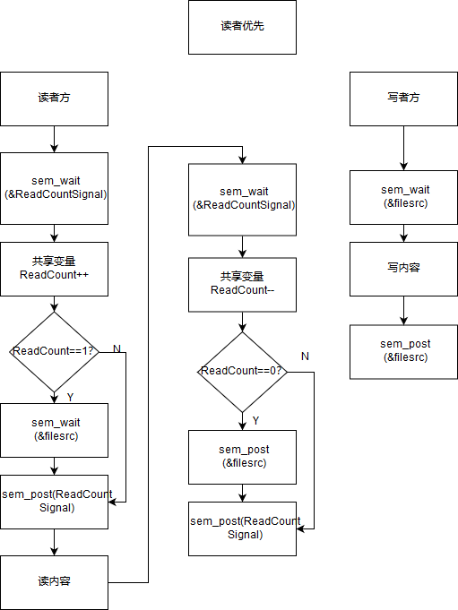
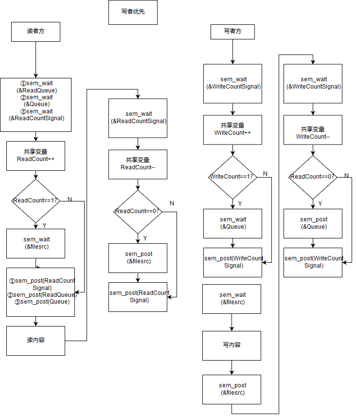

# Teamwork3

**uPuZu 丁帅 李亚男 徐磊(按姓氏首字母排序)**

## 实验目的

​	1、熟悉读者写者

​	2、读者、写者问题多线程实现

## 实验内容

	* 一个数据集（如数据、文件等）被多个线程读写；
	* 一些线程只要求读数据集内容，称为读者；
	* 一些线程只要求写数据集内容，称为写者；
	* 多个读者可以同时读数据集内容，不需要互斥操作；
	* 一个写者不能和其他写者或读者同时访问数据集

1. 读者优先
2. 写者优先

## 流程图





## 实验内容与结果

### 读者优先

```c
/*
* 	读者优先
*/

# include <stdio.h>
# include <stdlib.h>
# include <time.h>
# include <sys/types.h>
# include <pthread.h>
# include <semaphore.h>
# include <string.h>
# include <unistd.h>

//semaphores
sem_t ReadCountSignal, FileSrc;
int readCount;


struct data {
	int id;
	int opTime;
	int lastTime;
};

//读者
void* Reader(void* param) {
	int id = ((struct data*)param)->id;
	int lastTime = ((struct data*)param)->lastTime;
	int opTime = ((struct data*)param)->opTime;

	sleep(opTime);
	printf("Thread %d: waiting to read\n", id);	

	sem_wait(&ReadCountSignal);
	readCount++;
	if(readCount == 1)
		sem_wait(&FileSrc);
	sem_post(&ReadCountSignal);

	printf("Thread %d: start reading\n", id);
	/* reading is performed */
	sleep(lastTime);
	printf("Thread %d: end reading\n", id);

	sem_wait(&ReadCountSignal);
	readCount--;
	if(readCount == 0)
		sem_post(&FileSrc);
	sem_post(&ReadCountSignal);

	pthread_exit(0);
}

//写者
void* Writer(void* param) {
	int id = ((struct data*)param)->id;
	int lastTime = ((struct data*)param)->lastTime;
	int opTime = ((struct data*)param)->opTime;

	sleep(opTime);
	printf("Thread %d: waiting to write\n", id);
	
	sem_wait(&FileSrc);
	printf("Thread %d: start writing\n", id);
	/* writing is performed */
	sleep(lastTime);
	printf("Thread %d: end writing\n", id);
	sem_post(&FileSrc);
	
	pthread_exit(0);
}

int main() {
	//pthread
	pthread_t tid; // the thread identifier

	pthread_attr_t attr; //set of thread attributes

	/* get the default attributes */
	pthread_attr_init(&attr);

	//initial the semaphores
    sem_init(&ReadCountSignal, 0, 1);
    sem_init(&FileSrc, 0, 1);

    readCount = 0;

	int id = 0;
	while(scanf("%d", &id) != EOF) {

		char role;		//producer or consumer
		int opTime;		//operating time
		int lastTime;	//run time

		scanf("%c%d%d", &role, &opTime, &lastTime);
		struct data* d = (struct data*)malloc(sizeof(struct data));

		d->id = id;
		d->opTime = opTime;
		d->lastTime = lastTime;

		if(role == 'R') {
			printf("Create the %d thread: Reader\n", id);
			pthread_create(&tid, &attr, Reader, d);

		}
		else if(role == 'W') {
			printf("Create the %d thread: Writer\n", id);
			pthread_create(&tid, &attr, Writer, d);
		}
	}

	sem_destroy(&ReadCountSignal);
	sem_destroy(&FileSrc);

	return 0;
}
```

#### 运行结果

```
1 R 3 5
2 W 4 5
3 R 5 2
4 R 6 5
5 W 7 3
Create the 1 thread: Reader
Create the 2 thread: Writer
Create the 3 thread: Reader
Create the 4 thread: Reader
Create the 5 thread: Writer
Thread 1: waiting to read
Thread 1: start reading
Thread 2: waiting to write
Thread 3: waiting to read
Thread 3: start reading
Thread 4: waiting to read
Thread 4: start reading
Thread 3: end reading
Thread 5: waiting to write
Thread 1: end reading
Thread 4: end reading
Thread 2: start writing
Thread 2: end writing
Thread 5: start writing
Thread 5: end writing
^C
```

#### 结果解读

创建了5个线程，最开始的数字代表线程号，R代表读者，W代表写者，R或W后面的两个数字分别代表申请临界区前的运行时间和操作临界区的时间。由于5个线程同时开启，在例子中可以认为线程1是读者线程，第3秒申请缓冲区，操作5秒。

可以看到，2和5是写者线程，最后执行。

#### 思路分析

在读者优先中：

***读者方：***

①	对读写的数据集使用信号量filesrc进行保护，即读写临界区代码，读者和写者无法同时对数据集进行访问；

②	共享变量readCount记录当前读者数量，第一个读者申请到filesrc信号量后，最后一个读者释放filesrc信号量。

③	使用信号量ReadCountSignal对共享变量readCount进行保护；申请到信号量ReadCountSignal才可对readCount操作，操作完毕后释放信号量。

④	为了保障读者优先完成，因此读者具有弱优先级，当有读者操作临界区时，后续读者拥有更多优先级

***写者方：***

①	只有读者全部读完并释放filesrc信号量后，写者才能申请到filesrc信号量，进行写操作，操作完毕后，释放信号量。

### 写者优先

```c
/*
* 	写者优先
*/

# include <stdio.h>
# include <stdlib.h>
# include <time.h>
# include <sys/types.h>
# include <pthread.h>
# include <semaphore.h>
# include <string.h>
# include <unistd.h>

//semaphores
sem_t Queue, WriteCountSignal, ReadCountSignal, ReadQueue, FileSrc;
int writeCount, readCount;


struct data {
	int id;
	int opTime;
	int lastTime;
};

//读者
void* Reader(void* param) {
	int id = ((struct data*)param)->id;
	int lastTime = ((struct data*)param)->lastTime;
	int opTime = ((struct data*)param)->opTime;

	sleep(opTime);
	printf("Thread %d: waiting to read\n", id);	

	sem_wait(&ReadQueue);
	sem_wait(&Queue);
	sem_wait(&ReadCountSignal);
	readCount++;
	if(readCount == 1)
		sem_wait(&FileSrc);
	sem_post(&ReadCountSignal);
	sem_post(&Queue);
	sem_post(&ReadQueue);

	printf("Thread %d: start reading\n", id);
	/* reading is performed */
	sleep(lastTime);
	printf("Thread %d: end reading\n", id);

	sem_wait(&ReadCountSignal);
	readCount--;
	if(readCount == 0)
		sem_post(&FileSrc);
	sem_post(&ReadCountSignal);

	pthread_exit(0);
}

//写者
void* Writer(void* param) {
	int id = ((struct data*)param)->id;
	int lastTime = ((struct data*)param)->lastTime;
	int opTime = ((struct data*)param)->opTime;

	sleep(opTime);
	printf("Thread %d: waiting to write\n", id);
	
	sem_wait(&WriteCountSignal);
	writeCount++;
	if(writeCount == 1){
		sem_wait(&Queue);
	}
	sem_post(&WriteCountSignal);
	
	sem_wait(&FileSrc);
	printf("Thread %d: start writing\n", id);
	/* writing is performed */
	sleep(lastTime);
	printf("Thread %d: end writing\n", id);
	sem_post(&FileSrc);

	sem_wait(&WriteCountSignal);
	writeCount--;
	if(writeCount == 0) {
		sem_post(&Queue);
	}
	sem_post(&WriteCountSignal);
	
	pthread_exit(0);
}

int main() {
	//pthread
	pthread_t tid; // the thread identifier

	pthread_attr_t attr; //set of thread attributes

	/* get the default attributes */
	pthread_attr_init(&attr);

	//initial the semaphores
    sem_init(&WriteCountSignal, 0, 1);
    sem_init(&ReadCountSignal, 0, 1);
    sem_init(&ReadQueue, 0, 1);
    sem_init(&FileSrc, 0, 1);
    sem_init(&Queue, 0, 1);

    readCount = writeCount = 0;

	int id = 0;
	while(scanf("%d", &id) != EOF) {

		char role;		//producer or consumer
		int opTime;		//operating time
		int lastTime;	//run time

		scanf("%c%d%d", &role, &opTime, &lastTime);
		struct data* d = (struct data*)malloc(sizeof(struct data));

		d->id = id;
		d->opTime = opTime;
		d->lastTime = lastTime;

		if(role == 'R') {
			printf("Create the %d thread: Reader\n", id);
			pthread_create(&tid, &attr, Reader, d);

		}
		else if(role == 'W') {
			printf("Create the %d thread: Writer\n", id);
			pthread_create(&tid, &attr, Writer, d);
		}
	}

	sem_destroy(&WriteCountSignal);
	sem_destroy(&ReadCountSignal);
	sem_destroy(&ReadQueue);
	sem_destroy(&Queue);
	sem_destroy(&FileSrc);

	return 0;
}
```

#### 运行结果

```
1 R 3 5
2 W 4 5
3 R 5 2
4 R 6 5
5 W 7 3
Create the 1 thread: Reader
Create the 2 thread: Writer
Create the 3 thread: Reader
Create the 4 thread: Reader
Create the 5 thread: Writer
Thread 1: waiting to read
Thread 1: start reading
Thread 2: waiting to write
Thread 3: waiting to read
Thread 4: waiting to read
Thread 5: waiting to write
Thread 1: end reading
Thread 2: start writing
Thread 2: end writing
Thread 5: start writing
Thread 5: end writing
Thread 3: start reading
Thread 4: start reading
Thread 3: end reading
Thread 4: end reading
^C
```

#### 结果分析

含义同上，可以看到，线程1最先抢占了临界区，其余线程等待。其中，线程2和5等待在Queue信号量上，剩下的读者等待着ReadQueue信号量上。线程2占据Queue信号，在FileSrc上排队；5在Queue上排队；3占据ReadQueue信号量，在Queue上排队；4在ReadQueue排队（很重要，不是在Queue上排队，使得Queue上至多只有一个读者，保证了写者在排队时的优先级）。当2开始执行后，Queue释放，5可以执行，3占据Queue，排队FileSrc，4继续排队在ReadQueue。该顺序与实际执行的结果相同。

#### 思路分析

写者优先：

***读者方：***

①	读者方在读者优先基础上（ReadCountSignal信号量对共享变量readCount保护，filesrc信号量对数据集保护）新增ReadQueue、Queue信号量；

②	读者需要依次申请到ReadQueue、Queue信号量才能申请filesrc信号量；

***写者方：***

①	写者方申请到Queue后，申请filesrc信号量。

②	所有写者操作完毕后，释放Queue信号量。

***注意***

①	使用ReadQueue信号量来保证在等待Queue信号量的队列上不会出现读者的长队与写者一起调度，保证写者优先级更高；

②	Queue信号量在读者中释放时需要考量时机；若放在读操作后，至多一个读者可访问临界区，释放过早则会退化到读者优先。

## 实验总结

​	   对于信号量的思考十分复杂，需要考虑死锁，信号量的释放时机，队列优先级等多个问题。同时，多线程编译时需要添加-pthread选项。
