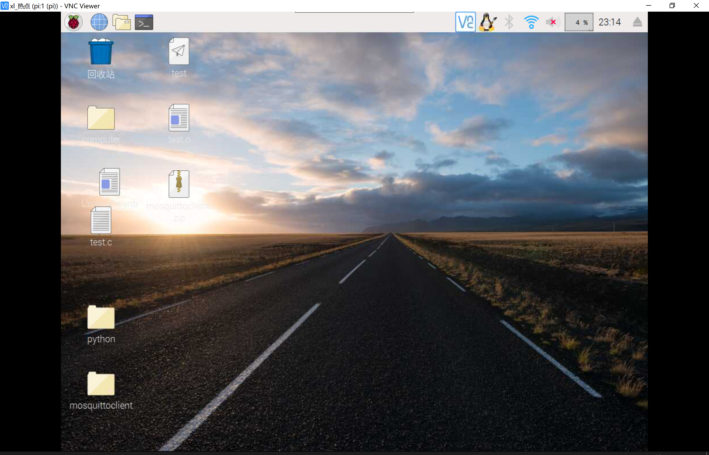
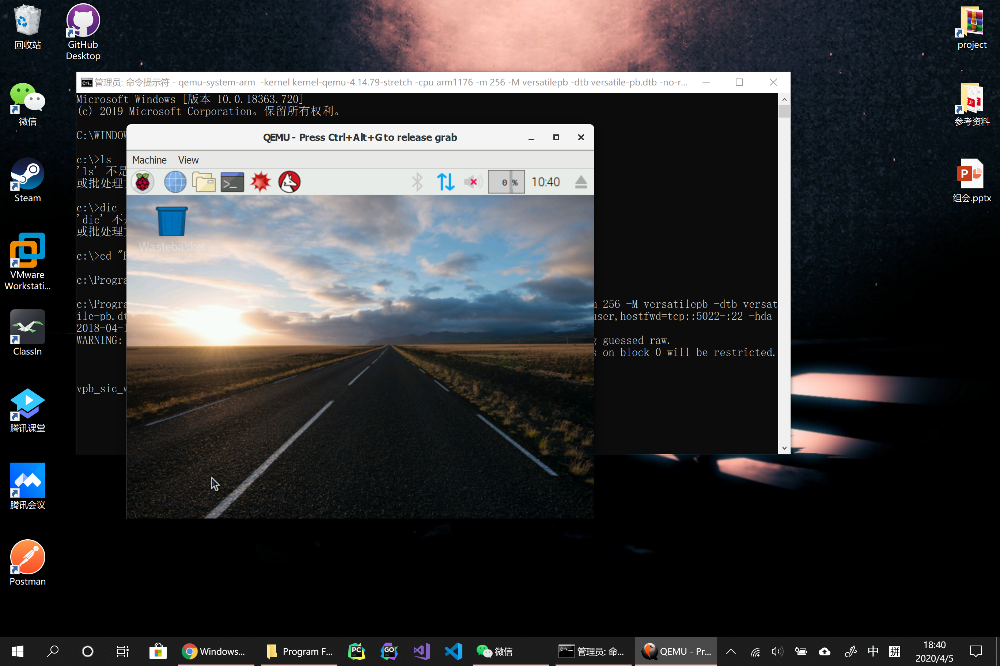
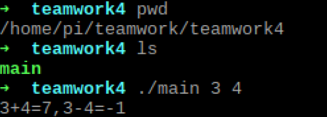
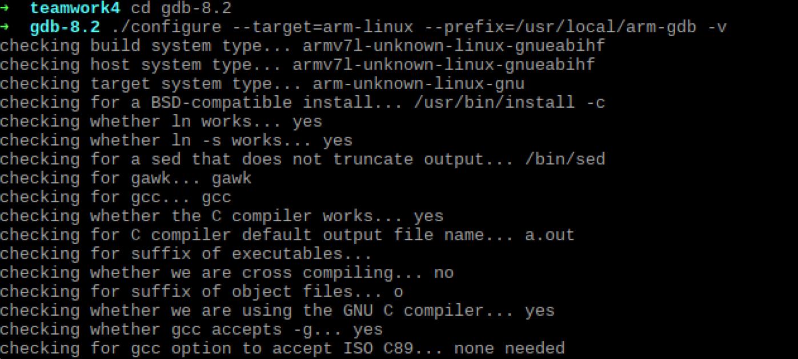
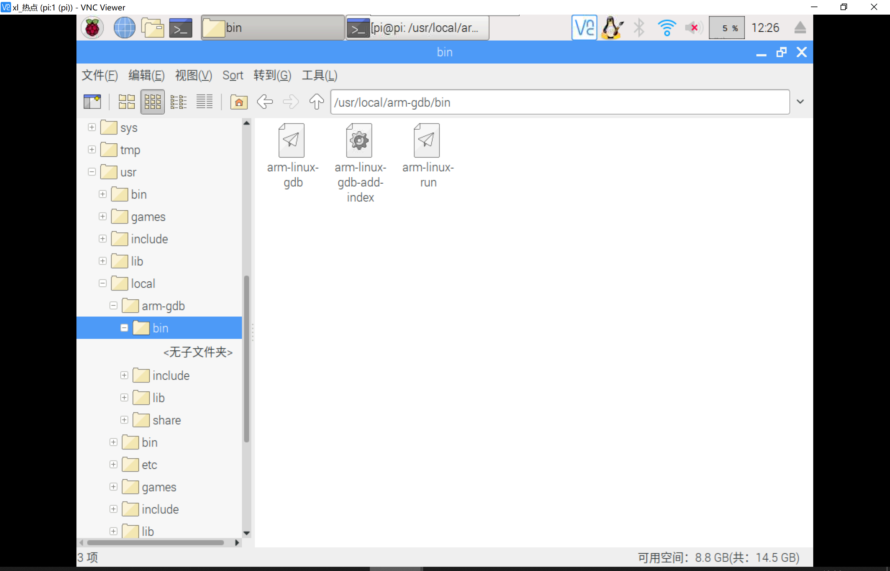
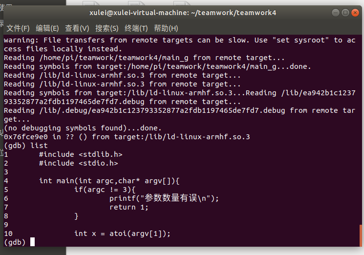

# 构建主机端开发环境

#### upuzu

#### 徐磊 李亚男 丁帅

## 一、实验目的
学会下载安装Linux及相关工具到目标机或目标机仿真环境。 

学会使用交叉编译器编译应用程序，并能够将可执行程序下载到目标机运行。 

学会使用交叉调试工具gdb-gdbserver调试应用程序。 


## 二、实验内容

Host-Target 连接 

构建并测试开发板交叉编译器

建立gdb-gdbserver交叉调试环境并能够调试应用程序

## 三、实验过程与结果

### 1、Host-Target

使用vnc实现树莓派连接

> 

qemu连接树莓派


### 2、构建并测试开发板交叉编译器 

安装交叉编译工具

```
sudo apt install gcc-arm-linux-gnueabihf
```

测试是否安装成功——在终端键入:
```
arm-linux-gnueabihf-gcc -v 
```
使用第一次作业的main.c并编译

```
arm-linux-gnueabihf-gcc main.c -o main -lm 
```
然后使用scp指令将生成的可执行文件copy到树莓派中

```
scp main pi@192.168.43.241:/home/pi/teamwork/teamwork4
```

也可使用FTP来进行传输，如果文件传输更频繁，我比较喜欢用这种方法

查看传输过来的文件并运行



### 3、建立gdb-gdbserver交叉调试环境

（1）下载：本地下载下http://ftp.gnu.org/gnu/gdb/gdb-8.2.tar.gz 版本，完成后用ftp或scp传输到树莓派指定位置，解压安装包

```
tar xvzf gdb-8.2.tar.gz
```

（2）配置 gdb ：

配置环境：$

```
cd gdb-8.2
./configure --target=arm-linux --prefix=/usr/local/arm-gdb -v 
```



编译(请准备好多杯咖啡，每个命令等待时间都很长)

```
make
sudo apt-get install texinfo
sudo make install
```

如果配置成功, 则生成/usr/local/arm-gdb 

进入./bin中，找到 arm-linux-gdb，加入环境变量或者拷贝到/usr/bin，以方便调用 

```
sudo cp arm-linux-gdb /usr/bin/ 
或
export PATH=$PATH:/usr/local/arm-gdb/bin
```
> 

进入/pi/gdb-8.2/gdb/gdbserver 文件夹，编译gdbserver，命令中的CC变量指定的是gcc编译器： 

```
export PATH=$PATH:/usr/local/arm-gdb/bin 
./configure --target=arm-linux --host=arm-linux 
make CC=arm-linux-gnueabihf-gcc
```

这一步完成之后，在 gdbserver 的目录下生成gdbserver的可执行文件，拷贝到teamwork下

实际上，树莓派可以直接下载gdbserver而不需要这么麻烦....

```
sudo apt-get install gdbserver
```

此后我们就可以用gdbserver进行调试了，简单来讲就是指定端口号，host和target通过该端口号进行通信

首先在Host端生成带有调试信息的main_g文件并传到target

```
arm-linux-gnueabihf-gcc -g main.c -o main_g -lm
scp main_g pi@192.168.43.241:/home/pi/teamwork/teamwork4
```

在树莓派端执行./gdbserver :1234 main_g:

其中1234是指定的端口


在host端安装gdb-multiarch，因为arm-linux-gnueabihf没有gdb

```
gdb-multiarch
(gdb)target remote 192.168.43.241:1234 
```

host端：



target端：

![]./pic/target.png)

可以看到这个交叉调试是有效的。 

## 四、实验问题

1. 交叉编译工具安装失败

   安装交叉编译工具：

   ```
   git clone git://github.com/raspberrypi/tools.git 
   cd ~/raspberrypi/tools/arm-bcm2708/ 
   ```

   打开.bashrc 文件（$ vim ~/.bashrc），在文件结尾加入：

   ```
   export PATH=$PATH:$HOME/raspberrypi/tools/arm-bcm2708/gcc-linaro-arm-linux-gnueabihf-raspbian-x64/bin 
   ```

   刷新环境变量:

   ```
   source ~/.bashrc
   ```

   并不能用，环境变量设置没问题

   应该是Ubuntu版本问题，实验用的是18.04。

2. 直接下载的arm-linux-gnueabihf-gcc没有gdb（解决）

   对于从12.04开始的Ubuntu主机，gdb-multiarch用作gdb客户端进行调试 . 顾名思义，它是任何架构的通用客户端，不限于ARM .通常，所有gdb客户端都是独立于体系结构的，因为体系结构特定部分在gdbserver本身中处理 . 所以，除了名称arm-linux-gnueabihf-gdb之外，我猜它和gdb-multiarch一样 .

## 五 总结

掌握了交叉编译和调试的基本流程，工具和方法


