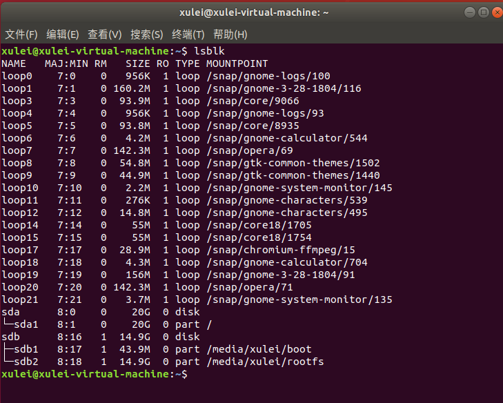

# 构建目标系统 

#### upuzu

#### 徐磊 李亚男 丁帅

## 实验目的

1. 掌握裁剪Linux内核的方法，理解内核选项的意义； 

2. 熟悉编译内核并加载内核到目标系统的方法与过程； 

3. 了解模块与内核的关系，掌握内核模块配置编译、安装与卸载流程，为进一步编程，如驱动编程打下基础； 

4. 掌握创建、安装(卸载)并使用文件系统的方法


## 实验内容

1. 首先用默认配置重新编译一遍已安装到开发板的内核，将新的内核替换现有内核，检查是否通过

2. 在原始版本基础上，重新配置Linux内核，构建一个嵌入式的Linux内核

3. 编译安装重新配置后的内核、模块及dtbs设备树 

4. 针对默认配置中不少于10个kernel feature进行重新配置（裁剪为主、偶有增加），并解释理由：(Y=>N，N=>Y)

5. 保留必要的模块安装，剩余(占多数)取消；(M=>N)

6. make后将新的内核安装到开发板运行测试； 

7. 选择至少二个模块加载与卸载，检查是否加载、卸载成功； 

8. 构建并安装至少一款不同于根文件系统、用于应用开发的其它文件系统。 


## 实验流程

## 1.替换内核

参考链接：https://www.raspberrypi.org/documentation/linux/kernel/building.md

编译新版本内核，以替换当前内核


安装git和相关依赖

```
sudo apt install git bc bison flex libssl-dev make
```

下载内核源码，并编译

注意版本

```
git clone --depth=1 https://github.com/raspberrypi/linux
#可更换为其他内核版本，具体请查阅https://github.com/raspberrypi/linux
#Clone需要很长时间，耐心等待
cd linux
KERNEL=kernel7
make ARCH=arm CROSS_COMPILE=arm-linux-gnueabihf- bcm2709_defconfig
make ARCH=arm CROSS_COMPILE=arm-linux-gnueabihf- zImage modules dtbs
#开始编译，可能需要几个小时，耐心等待
```

如果有多个处理器，可以给make指令加上参数-j n，其中n是处理器数量*1.5。这样可以加快编译速度。编译完成后，将整个linux目录传输到树莓派供树莓派使用。

装入sd卡，输入lsblk，获得分区目录



其中sdb是SD卡，sda是给ubuntu的分区

sdb1 是 FAT（boot）引导分区 类似启动文件。

sdb2 是 ext4文件系统分区

接下来，建个mnt文件夹用来挂载磁盘

```
mkdir mnt
mkdir mnt/fat32
mkdir mnt/ext4
sudo mount /dev/sdb1 mnt/fat32
sudo mount /dev/sdb2 mnt/ext4
```

接下来安装模组到mnt/ext4

```
sudo make ARCH=arm CROSS_COMPILE=arm-linux-gnueabihf- INSTALL_MOD_PATH=mnt/ext4 modules_install
```

最后复制内核文件到SD卡。这里最好备份下之前的内核文件。

```
sudo cp mnt/fat32/$KERNEL.img mnt/fat32/$KERNEL-backup.img    （备份旧内核）
sudo scripts/mkknlimg arch/arm/boot/zImage mnt/fat32/$KERNEL.img
sudo cp arch/arm/boot/dts/*.dtb mnt/fat32/
sudo cp arch/arm/boot/dts/overlays/*.dtb* mnt/fat32/overlays/
sudo cp arch/arm/boot/dts/overlays/README mnt/fat32/overlays/
sudo umount mnt/fat32
sudo umount mnt/ext4
kernel=kernel-myconfig.img
```

把SD卡插到树莓派然后重启，uname -a查看下版本


## 2. 内核配置

参考链接：https://www.raspberrypi.org/documentation/linux/kernel/configuring.md

Linux内核是高度可配置的， 高级用户可能希望修改默认配置，以根据他们的需要对其进行自定义，例如启用新的或实验性的网络协议，或启用对新硬件的支持。配置通常是通过`make menuconfig`界面完成的。 另外，也手动修改.config文件件系统。由于官方对于普通用户相对推荐第一种，这里也用第一种来操作。

menuconfig工具需要ncurses开发标头才能正确编译。 这些可以使用以下命令安装

```
sudo apt install libncurses5-dev
```

清理之前编译的内核

```
make ARCH=arm CROSS_COMPILE=arm-linux- distclean
```

一切准备就绪并准备就绪后，使用交叉编译，按以下方式编译和运行menuconfig实用程序：

```
make ARCH=arm CROSS_COMPILE=arm-linux-gnueabihf- menuconfig
```

在选择相应的配置时，有三种选择方式，它们分别代表的含义如下： 
  Y－-将该功能编译进内核  
  N－-不将该功能编译进内核  
  M－-将该功能编译成可以在需要时动态插入到内核中的模块  
这里使用的是 `make  menuconfig`，所以需要使用空格键进行选取。其中有不少选项是目标板开发人员加的，对于陌生选项，保持默认值。


在每一个选项前都有一个括号， 有的是中括号有的是尖括号，还有圆括号。用空格键选择时可以发现，中括号里要么是空，要么是“\*”， 尖括号里可以为空，"\*"和"M"这表示前者对应的项要么不要，要么编译到内核里；后者
则多一样选择，可以编译成模块。而圆括号的内容是要你在所提供的几个选项中选择一项。


精简信息如下：

```
#东芝模块
Processor type and features  ---> Toshiba Laptop support
#Dell笔记本模块支持
Processor type and features  ---> Dell laptop support
#ipv6用不到
Networking support  --->  Networking options  --->  The IPv6 protocol  --->   
#无线电
Networking support  --->  Networking options  --->  Amateur Radio support  --->
#SYN攻击
Networking support  --->  Networking options  --->  IP: TCP syncookie support
#游戏设备
Device Drivers  --->  Input device support  --->  Joysticks/Gamepads  --->
#平板pc
Device Drivers  --->  Input device support  --->  Tablets  --->
#触摸屏
Device Drivers  --->  Input device support  ---> Touchscreens  --->
#人力工程学设备
Device Drivers  --->  HID Devices  --->
#笔记本驱动
Device Drivers  --->  X86 Platform Specific Device Drivers
```

完成所需的更改后，保存。 默认情况下，这将保存到.config文件，可以通过复制该文件来保存和加载配置。

然后执行第一部分内容即可

## 3. 模块加载与卸载

可以加载上一步设置为M的模块。

内核模块是可以按需要随时装入和卸下的。这样做可以使得内核的大小和通信量都达到最小。将模块从内核中独立出来，不必预先『绑』在 kernel codes 中。这样做有三种优点： 第一， 将来修改 kernel 时，不必全部重新compile，可节省不少时间；第二， 若需要安装新的 modules ，不必重新 compile kernel，只要插入 (通过`insmode`指令) 对应的 modules 即可；第三，减少内核对系统资源的占用，内核可以集中精力做最基本的事情，把一些扩展功能都交由modules实现

查看模块

```
lsmod
```


卸载模块，可以看到，i2c卸载成功

```
sudo rmmod i2c_dev 
```


加载模块，其他模块也可以用类似的路径来查看

```
 sudo insmod /lib/modules/<内核版本>/kernel/drivers/i2c/i2c_dev.ko
```


## 4. 文件系统（NAS文件系统）

初始文件系统，最后的sda1为外挂的usb设备

```
sudo fdisk -l
```


首先，删除磁盘分区表，创建一个新的并且只包含一个分区的新分区表。在 `fdisk` 中，你可以使用交互单字母命令来告诉程序你想要执行的操作。只需要在提示符 `Command(m for help):` 后输入相应的字母即可（可以使用 `m` 命令获得更多详细信息）：

```
➜  ~ sudo fdisk /dev/sda     

Welcome to fdisk (util-linux 2.29.2).
Changes will remain in memory only, until you decide to write them.
Be careful before using the write command.


Command (m for help): p
Disk /dev/sda: 30 GiB, 32245809152 bytes, 62980096 sectors
Units: sectors of 1 * 512 = 512 bytes
Sector size (logical/physical): 512 bytes / 512 bytes
I/O size (minimum/optimal): 512 bytes / 512 bytes
Disklabel type: dos
Disk identifier: 0xe49584b3

Device     Boot Start      End  Sectors Size Id Type
/dev/sda1        2048 62980095 62978048  30G 83 Linux

Command (m for help): m

Help:

  DOS (MBR)
   a   toggle a bootable flag
   b   edit nested BSD disklabel
   c   toggle the dos compatibility flag

  Generic
   d   delete a partition
   F   list free unpartitioned space
   l   list known partition types
   n   add a new partition
   p   print the partition table
   t   change a partition type
   v   verify the partition table
   i   print information about a partition

  Misc
   m   print this menu
   u   change display/entry units
   x   extra functionality (experts only)

  Script
   I   load disk layout from sfdisk script file
   O   dump disk layout to sfdisk script file

  Save & Exit
   w   write table to disk and exit
   q   quit without saving changes

  Create a new label
   g   create a new empty GPT partition table
   G   create a new empty SGI (IRIX) partition table
   o   create a new empty DOS partition table
   s   create a new empty Sun partition table


Command (m for help): o
Created a new DOS disklabel with disk identifier 0xaba47e67.

Command (m for help): p
Disk /dev/sda: 30 GiB, 32245809152 bytes, 62980096 sectors
Units: sectors of 1 * 512 = 512 bytes
Sector size (logical/physical): 512 bytes / 512 bytes
I/O size (minimum/optimal): 512 bytes / 512 bytes
Disklabel type: dos
Disk identifier: 0xaba47e67

Command (m for help): n
Partition type
   p   primary (0 primary, 0 extended, 4 free)
   e   extended (container for logical partitions)
Select (default p): 

Using default response p.
Partition number (1-4, default 1): 
First sector (2048-62980095, default 2048): 
Last sector, +sectors or +size{K,M,G,T,P} (2048-62980095, default 62980095): 

Created a new partition 1 of type 'Linux' and of size 30 GiB.

Command (m for help): p
Disk /dev/sda: 30 GiB, 32245809152 bytes, 62980096 sectors
Units: sectors of 1 * 512 = 512 bytes
Sector size (logical/physical): 512 bytes / 512 bytes
I/O size (minimum/optimal): 512 bytes / 512 bytes
Disklabel type: dos
Disk identifier: 0xaba47e67

Device     Boot Start      End  Sectors Size Id Type
/dev/sda1        2048 62980095 62978048  30G 83 Linux

Command (m for help): w
The partition table has been altered.
Calling ioctl() to re-read partition table.
Syncing disks.
```

用 ext4 文件系统格式化新创建的分区 `/dev/sda1`：

```
➜  ~ sudo mkfs.ext4 /dev/sda1
mke2fs 1.43.4 (31-Jan-2017)
创建含有 7872256 个块（每块 4k）和 1970416 个inode的文件系统
文件系统UUID：c73622e3-ed92-40e2-b756-9b860b1cdfc6
超级块的备份存储于下列块： 
	32768, 98304, 163840, 229376, 294912, 819200, 884736, 1605632, 2654208, 
	4096000

正在分配组表： 完成                            
正在写入inode表： 完成                            
创建日志（32768 个块）完成
写入超级块和文件系统账户统计信息： 已完成
```

根据用途来建立标签并挂载，创建相关文件

```
sudo e2label /dev/sda1 data
sudo mkdir /nas/data
sudo mount -L data /nas/data
sudo touch test.txt 
```


现在你已经设置了基本的网络存储，我们希望将它安装到远程 Linux 机器上。这里使用 NFS 文件系统，首先在树莓派上安装 NFS 服务器：

```text
sudo apt install nfs-kernel-server
```

然后，需要告诉 NFS 服务器公开 `/nas/data` 目录，这是从树莓派外部可以访问的唯一设备（另一个用于备份）。编辑 `/etc/exports` 添加如下内容以允许所有可以访问 NAS 云盘的设备挂载存储：

```text
/nas/data *(rw,sync,no_subtree_check)
```

更多有关限制挂载到单个设备的详细信息，请参阅 `man exports`。经过上面的配置，任何人都可以访问数据，只要他们可以访问 NFS 所需的端口：`111` 和 `2049`。

```
sudo mkdir /nas/data
sudo mount -t nfs 190.121.43.241:/nas/data /nas/data
```

结果如图：


## 总结

了解内核的编译和裁剪，了解模块安装卸载，并成功构建了nas文件系统。